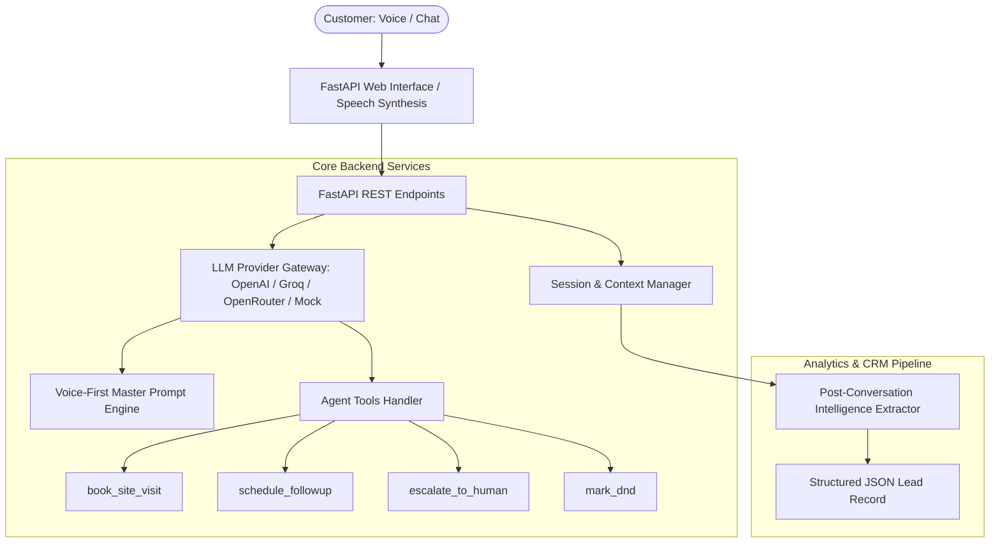

# Huvo AI — Forward Deployed Engineer Assignment
### Conversational AI Sales Agent for Northstar Homes (`Northstar One`, Sector 79, Gurugram)

[](https://www.python.org/downloads/)
[](https://fastapi.tiangolo.com/)
[](https://opensource.org/licenses/MIT)
[]()

---

## 🌟 Executive Overview
This repository contains the complete implementation for the **Huvo AI Forward Deployed Engineer Assignment**.

We have built a production-grade, conversational sales agent named **"Tara"**, representing **Northstar Homes** for the flagship luxury residential project **Northstar One** in **Sector 79, Gurugram**.

The agent is engineered from the ground up to operate across **both real-time Voice / Telephony interactions and Web Chat**, supporting natural **English, Hindi, and Hinglish** code-switching, lead qualification, proactive objection handling, site-visit appointment scheduling with failure recovery, DND compliance, anti-hallucination guardrails, and automated post-conversation structured analytics extraction.

---

## 🏢 Project Information & Knowledge Base

| Attribute | Details |
|---|---|
| **Company** | Northstar Homes |
| **Project** | Northstar One |
| **Location** | Sector 79, Gurugram, Haryana (5 mins from NH-48 & SPR, near Aravalli foothills) |
| **Configurations** | 2 BHK & 3 BHK Luxury Residences |
| **Starting Prices** | **2 BHK:** ₹1.35 Crore onwards <br> **3 BHK:** ₹1.75 Crore onwards |
| **Languages Supported** | English, Hindi (हिन्दी), Hinglish |
| **Primary Goal** | Understand customer requirements, answer questions, qualify leads, and arrange site visits. |

---

## 🏗️ Architecture Overview



---

## 🧠 Part 1 — Prompt Engineering Approach

The master prompt (`PROMPT.md` and `prompt.txt`) is tailored specifically for **Voice + Chat dual modality**:

### 1. Spoken Cadence & Voice Compatibility
- **Concise Turn Lengths**: 1 to 3 sentences per turn to maintain conversational rhythm on voice calls.
- **Zero Markdown Clutter in Spoken Output**: Avoids asterisks (`**bold**`), bullet points, numbered lists, and emojis which cause Text-to-Speech (TTS) engines to sound robotic or read markup aloud.
- **Single-Question Principle**: Asks one question at a time to prevent cognitive overload.
- **Active Listening**: Acknowledges customer input before pivoting (`"Understood"`, `"Bilkul"`, `"I completely see your point"`).

### 2. Natural Multilingual & Code-Switching
The agent dynamically matches the customer's language and dialect:
- **English**: Professional, courteous, consultative tone.
- **Hindi**: Polite and respectful Devanagari/Hinglish vocabulary.
- **Hinglish**: Seamless colloquial transitions (e.g., *"Main samajh sakti hoon. Sector 79 NH-48 se sirf 5 minute ki distance par hai aur Aravalli views ke saath clean environment deta hai..."*).

### 3. Strict Anti-Hallucination Guardrails
- **Zero Inventions**: The agent never fabricates unconfirmed discounts (e.g., "25% off"), non-existent layouts (e.g., 4 BHK penthouses with private pools), or unverified availability.
- **Consultant Routing**: Queries outside verified facts are acknowledged politely and routed to Senior Property Specialists.

### 4. Comprehensive Playbooks
1. **Lead Qualification**: Weaves in inquiries regarding configuration (2 vs 3 BHK), budget fit, purchase timeline, and purpose (end-use vs investment).
2. **Objection Handling**:
   - *Price Objection*: Validates concern, emphasizes superior construction, Aravalli green views, and invites to evaluate layout at the show flat.
   - *Location / Distance Objection*: Explains connectivity (5 mins from NH-48, SPR, Cloverleaf flyover to Cyber City).
3. **Busy / Call Later Customers**: Respects customer's schedule immediately, logs follow-up, offers WhatsApp summary.
4. **DND / Stop Communication**: Zero friction or pushback; immediately marks Do-Not-Disturb and offers polite sign-off.
5. **Site Visit Booking & Slot Failure Handling**: Proactively books visits; if a slot is unavailable (e.g., 2 PM slot full), gracefully offers alternative slots (Sunday 4:30 PM or Monday 11:00 AM).
6. **Human Escalation**: Smoothly routes price negotiations or complex structuring requests to Senior Sales Managers.

---

## 💻 Part 2 — Technical Implementation

### Key Backend Components (FastAPI + Python 3.11)
- **`app/main.py`**: FastAPI entrypoint with CORS, route mounting, static file serving.
- **`app/prompts.py`**: Master system prompt and structured analytics extraction templates.
- **`app/llm_client.py`**: Multi-provider LLM gateway supporting OpenAI, Groq, OpenRouter, and a built-in Mock LLM engine (ensuring offline execution without requiring an API key).
- **`app/tools.py`**: CRM execution tools (`book_site_visit`, `schedule_followup`, `escalate_to_human`, `mark_dnd`) with controllable failure simulation.
- **`app/session_manager.py`**: Thread-safe conversation state & context management.
- **`app/analytics.py`**: Automated Pydantic-based lead intelligence extraction.
- **`app/static/`**: Luxury real-estate web interface with Web Speech API audio voice output, real-time Lead Qualification Card, and scenario launcher.

---

## 🚀 How to Run the Bot

### 1. Prerequisites
- Python 3.11+
- Git

### 2. Clone and Setup Environment
```bash
# Clone the repository
git clone https://github.com/your-username/huvo-ai-assignment.git
cd huvo-ai-assignment

# (Optional) Create virtual environment
python -m venv venv
# On Windows:
.\venv\Scripts\activate
# On macOS/Linux:
source venv/bin/activate

# Install dependencies
pip install -r requirements.txt
```

### 3. Environment Configuration
Create a `.env` file from `.env.example`:
```bash
cp .env.example .env
```

Edit `.env` (Optional — leave `LLM_PROVIDER=mock` to run offline without an API key):
```ini
LLM_PROVIDER=openai
OPENAI_API_KEY=sk-proj-your-api-key
OPENAI_MODEL=gpt-4o-mini
```

### 4. Start the Application
```bash
python -m uvicorn app.main:app --host 0.0.0.0 --port 8000 --reload
```

Open your browser at: **`http://localhost:8000`**

---

## 🖥️ Web Interface Features

1. **Interactive Real-Time Chat**: Fluid conversation stream with typing indicators and tool execution tags.
2. **🔊 Voice Audio Mode (TTS)**: Built-in speech synthesis simulator using browser Web Speech API to test spoken cadence.
3. **⚡ Live Lead Qualification Card**: Real-time sidebar updating extracted budget, configuration, site-visit status, and lead temperature.
4. **⚠️ Booking Failure Simulator Toggle**: Easily simulate overbooked slots and demonstrate fallback handling live.
5. **🧪 Evaluation Scenario Launcher**: 1-click test buttons to demonstrate Hindi queries, price objections, DND, etc.
6. **📊 Post-Conversation Analytics Modal**: Click *"End & Generate Analytics"* to view rich CRM KPI cards and download full JSON intelligence data.

---

## 📊 Post-Conversation Analytics Schema

When a conversation ends, the backend generates structured JSON adhering to the following schema:

```json
{
  "customer_name": "Amit Sharma",
  "phone_number": "+91 98765 43210",
  "budget": "₹1.75 Cr - ₹2.0 Cr",
  "budget_fit": "Within Range",
  "configuration_interest": "3 BHK",
  "interest_level": "High",
  "purchase_timeline": "1-3 months",
  "purpose_of_purchase": "End-use",
  "site_visit_status": "Booked",
  "site_visit_details": {
    "success": true,
    "booking_id": "NSO-3C30A9",
    "project": "Northstar One",
    "location": "Sector 79, Gurugram",
    "date": "Sunday",
    "time_slot": "11:00 AM",
    "configuration": "3 BHK"
  },
  "lead_status": "Hot",
  "follow_up_requirement": {
    "required": true,
    "date_time": "1 day prior to visit",
    "channel": "WhatsApp",
    "reason": "Send site location coordinates and brochure"
  },
  "human_escalation_required": false,
  "key_objections_raised": [],
  "primary_language": "English",
  "conversation_summary": "Customer expressed strong interest in 3 BHK residences for family end-use and confirmed on-site visit for Sunday 11 AM.",
  "sentiment": "Positive",
  "next_steps": "Send site location coordinates and assign senior relationship manager for Sunday 11 AM tour."
}
```

---

## 🧪 Automated Testing & Evaluation Scenarios

Run the complete automated test suite:

```bash
# Run pytest test suite (14 passing tests)
python -m pytest -v

# Run the evaluation scenario runner and generate test_results.md
python tests/run_scenarios.py
```

### Scenario Test Matrix

| # | Test Scenario | Category | Expected Behaviour | Status |
|---|---------------|----------|-------------------|--------|
| 1 | **Qualification & Site Visit Booking** | Qualification | Qualifies 3 BHK, budget ₹1.75 Cr+, books site visit at 11 AM, returns booking ID. | ✅ PASS |
| 2 | **Hinglish Price Objection** | Objections & Language | Empathizes in Hinglish, highlights Aravalli views, invites to show flat. | ✅ PASS |
| 3 | **Hindi Location / Distance Query** | Multilingual | Explains Sector 79 connectivity (NH-48, SPR, Cloverleaf) in natural Hindi. | ✅ PASS |
| 4 | **Busy Customer / Call Later** | Call Flow | Immediately respects time, schedules callback via `schedule_followup`. | ✅ PASS |
| 5 | **Do-Not-Disturb (DND) Opt-Out** | Compliance | Immediately complies, tags lead as DND via `mark_dnd`, zero pushback. | ✅ PASS |
| 6 | **Out-of-Scope / Anti-Hallucination** | Guardrail | Refuses to invent 4 BHK / 25% discount, clarifies available 2 & 3 BHK configs. | ✅ PASS |
| 7 | **Booking Failure & Fallback** | Error Recovery | Gracefully handles overbooked 2 PM slot, offers Sunday 4:30 PM or Monday 11 AM. | ✅ PASS |
| 8 | **Human Escalation Request** | Escalation | Smoothly escalates to Senior Sales Manager via `escalate_to_human`. | ✅ PASS |
| 9 | **Post-Conversation Analytics** | Analytics & CRM | Generates structured JSON adhering to CRM schema. | ✅ PASS |

*Detailed execution logs are documented in [`test_results.md`](test_results.md).*

---

## 📌 Key Assumptions

1. **Pricing Policy**: Starting prices are ₹1.35 Cr (2 BHK) and ₹1.75 Cr (3 BHK). Any custom pricing or special payment schemes require Senior Sales Manager authorization.
2. **Channel Format**: Both chat and telephony voice interactions require natural spoken phrasing; therefore, markdown asterisks and numbered lists are omitted from assistant speech turns.
3. **Session Persistence**: Sessions are tracked in memory per unique `session_id`, making the backend stateless and easily pluggable into Redis or PostgreSQL for enterprise scale.
4. **CRM Integration**: Tool executions (`book_site_visit`, `mark_dnd`, etc.) return mock booking IDs simulating real-time webhook calls to CRM platforms like Salesforce or LeadSquared.

---

## ⚠️ Known Limitations

1. **TTS Accent Tuning**: In-browser speech synthesis depends on local OS voice engines; in telephony production, an external provider like ElevenLabs, Deepgram, or Cartesia would provide even richer neural Indian-English/Hindi voices.
2. **Concurrent Slot Locking**: Simulated site-visit slots are verified in-memory; in a production cluster, an external database with atomic locks would manage slot capacity.

---

## 🛠️ AI Tools Used

- **Claude / Gemini (Antigravity)**: Prompt engineering design, code structure architecture, test scenario generation.
- **OpenAI GPT-4o / GPT-4o-mini**: Evaluation & testing of multilingual conversational completions.

---

## 📄 License
This project is submitted for the **Huvo AI Forward Deployed Engineer Assignment**. Open sourced under the [MIT License](LICENSE).
